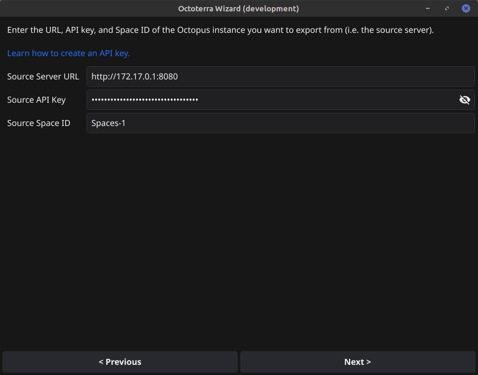
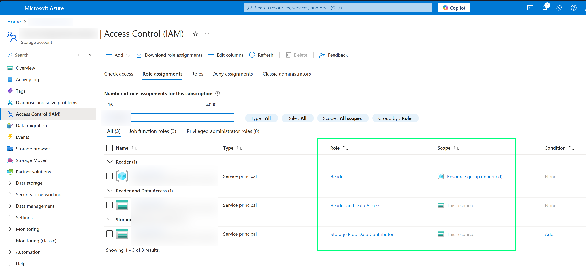

# OctoTerra Wizard

This tool prepares an Octopus space to allow space level resources and projects to serialized to a Terraform module and reapply them in another space.

* [Linux](https://github.com/mcasperson/OctoterraWizard/releases/latest/download/octoterrawiz_linux_amd64)
* [macOS](https://github.com/mcasperson/OctoterraWizard/releases/latest/download/octoterrawiz_macos_arm64)
* [Windows](https://github.com/mcasperson/OctoterraWizard/releases/latest/download/octoterrawiz_windows_amd64.exe)

## Documentation

View the docs [here](https://octopus.com/docs/administration/migrate-spaces-with-octoterra).

## Environment variables

The default values used by the wizard are defined in environment variables:

* `OCTOTERRAWIZ_SOURCE_SERVER`: The URL of the Octopus server to export from
* `OCTOTERRAWIZ_SOURCE_API_KEY`: The API key to use to connect to the source server
* `OCTOTERRAWIZ_SOURCE_SPACE_ID`: The ID of the space to export
* `OCTOTERRAWIZ_DESTINATION_SERVER`: The URL of the Octopus server to import to
* `OCTOTERRAWIZ_DESTINATION_API_KEY`: The API key to use to connect to the destination server
* `OCTOTERRAWIZ_DESTINATION_SPACE_ID`: The ID of the space to import to
* `OCTOTERRAWIZ_BACKEND_TYPE`: Either `AWS S3` or `Azure Storage`
* `AWS_ACCESS_KEY_ID`: [AWS environment variable](https://docs.aws.amazon.com/cli/latest/userguide/cli-configure-envvars.html)
* `AWS_SECRET_ACCESS_KEY`: [AWS environment variable](https://docs.aws.amazon.com/cli/latest/userguide/cli-configure-envvars.html)
* `AWS_DEFAULT_REGION`: [AWS environment variable](https://docs.aws.amazon.com/cli/latest/userguide/cli-configure-envvars.html)
* `AWS_DEFAULT_BUCKET`: The name of the S3 bucket holding the Terraform state
* `OCTOTERRAWIZ_PROMPT_FOR_DELETE`: If set to `true`, the tool will prompt for confirmation before deleting resources
* `OCTOTERRAWIZ_USE_CONTAINER_IMAGES`: If set to `true`, the tool will use container images to run Terraform steps
* `OCTOTERRAWIZ_AZURE_RESOURCE_GROUP`: The name of the Azure resource group holding the Terraform state
* `OCTOTERRAWIZ_AZURE_STORAGE_ACCOUNT`: The name of the Azure storage account holding the Terraform state
* `OCTOTERRAWIZ_AZURE_CONTAINER`: The name of the Azure storage container holding the Terraform state
* `AZURE_SUBSCRIPTION_ID`: [Azure environment variable](https://azure.github.io/static-web-apps-cli/docs/cli/env-vars/)
* `AZURE_TENANT_ID`: [Azure environment variable](https://azure.github.io/static-web-apps-cli/docs/cli/env-vars/)
* `AZURE_CLIENT_ID`: [Azure environment variable](https://azure.github.io/static-web-apps-cli/docs/cli/env-vars/)
* `AZURE_CLIENT_SECRET`: [Azure environment variable](https://azure.github.io/static-web-apps-cli/docs/cli/env-vars/)
* `OCTOTERRAWIZ_EXCLUDE_ALL_LIBRARY_VARIABLE_SETS`: If set to `true`, the tool will exclude all library variable sets from the export

## Screenshot

## Azure Storage Accounts with Terraform

These permissions allow you to use the Azure Storage Account as a Terraform backend. They may not be the most restrictive
permissions, but they have been tested.

Give you app:

* Reader access to the resource group
* Reader and Data Access to the storage account
* Storage Blob Data Contributor to the container

